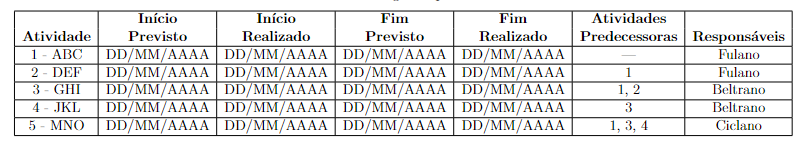

# Ata da Aula: 17/04/2024

## Pautas

### Definição da equipe

**Gerente:** Izabella 
**Vice-gerente:** Lucas Victor

- ESTRUTURAS E ENERGIA
1. Wallace (aero) **(sub-gerente)**
2. Nathan (aero)
3. Gabriel Gasparotto (energia)
4. ? (aero)

- EMBARCADOS
1. Mateus Fidelis **(sub-gerente)**
2. Vinícius Vilela (eletrônica)
3. Ana Letícia
4. Fause Carlos
5. Lucas Victor
6. Johnny Lopes

- DADOS
1. Esther Sena **(sub-gerente)**
2. Gabriel Scheidt 
3. Mariiana Siqueira 
4. Arthur Rodrigues 
5. Mateus Orlando 
6. Izabella Alves 
7. Lucas de Oliveira 
8. Miguel Arthur 
9. Raquel Eucaria 

### Metodologia de Gerenciamento

Foi definido pela equipe utilizar a Metodologia Ágil Scrum.

### EAP

Nesta reunião, iniciamos a criação do EAP. Ficou decidido que ele deve ser totalmente entregue no dia *24/04* e que cada área deve trabalhar na sua parte até a data final.

[O EAP está sendo feito no MIRO, para acessar clique aqui](https://miro.com/welcomeonboard/RWlZRDJTMng0OTBhY0FOZFh2ckN0bXE1UVRXVTBTQjR1Z2ZWZWhOZU9WdGdUYkh6dFhsYU5FalVxTUdEM1duSHwzNDU4NzY0NTI1NjY4MzYwODc3fDI=?share_link_id=346038158104).

### Cronograma

Discutimos o que o cronograma deve ser entregue até dia *24/04* e que cada área deve trabalhar na sua parte separadamente. Segue o modelo de cronograma disponível no modelo do relatório:

## Atividades

- **EAP**
    - 24/04/2024 
    - TODAS AS ÁREAS
- **CRONOGRAMA**
    - 24/04/2024
    - TODAS AS ÁREAS
- **PRIMEIRO RELATÓRIO**
    - 29/04/2024
    - Segue abaixo a estrutura

### Primeiro relatório - responsáveis

[LINK DO RELATÓRIO](https://www.overleaf.com/4412654797qssbmtttgfdb#294463)

**RESUMO:** Ana Letícia

**INTRODUÇÃO:** Gabriel Scheidt

**TERMO DE ABERTURA:** Johnny Lopes

**EQUIPE DE TRABALHO:** Izabella Alves

**CARACTERÍSTICAS GERAIS:** Wallace, Lucas Victor e Lucas de OIiveira

**EAP:** ÁREAS

**CRONOGRAMA:** ÁREAS / Raquel Eucaria (juntar os cronogramas e colocar no relatório)

**REVISÃO:** Mariiana Siqueira e Lucas de Oliveira

## Participantes

- ANA LETICIA MELO PEREIRA
- ESTHER SENA MARTINS
- FAUSE CARLOS MASCARENHAS LUSTOSA
- GABRIEL REIS SCHEIDT PAULINO
- IZABELLA ALVES PEREIRA
- JOHNNY DA PONTE LOPES
- LUCAS DE OLIVEIRA DIAS MARQUES FERREIRA
- LUCAS VICTOR FERREIRA DE ARAUJO
- MARIIANA SIQUEIRA NERIS
- MATEUS FIDELIS MARINHO MAIA
- NATHAN VINICIUS DE OLIVEIRA CONCEICAO
- RAQUEL TEMOTEO EUCARIA PEREIRA DA COSTA
- WALLACE DE OLIVEIRA FERREIRA

## Histórico de Versões

| Versão | Data | Descrição | Autor |
| :----: | ---- | --------- | ----- |
| `1.0`  |14/04/2024| Criação da ata | Izabella Alves|

